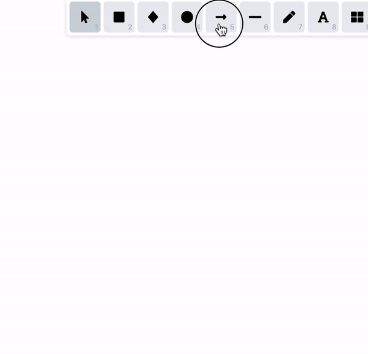

## Unexpected de-selection with bound multi-line arrow

Repro:

- Create a multi-line arrow
- Create a rectangle that is bound to the arrow
- Double click on the multi-line arrow to edit it
- Move the end of the arrow to be bound
- Click on the rectangle

Expected behavior:

- It selects the rectangle

Current behavior:

- It selects the rectangle and then unselects it

